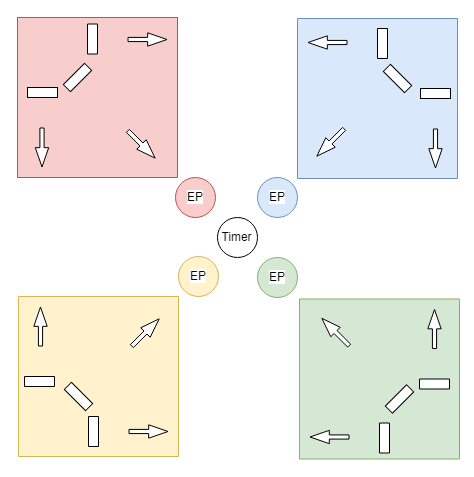
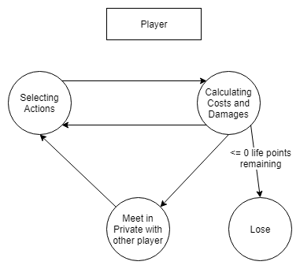
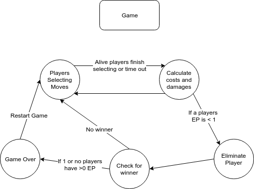
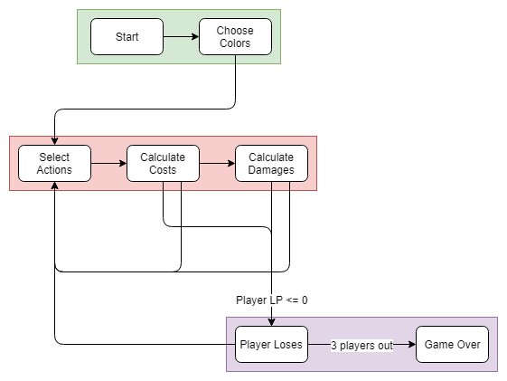

# Battle of the Four Gods - Game Design Document

## Table of Contents
1. Overview
2. Concept
3. Rules

## 1 Overview

### 1.1 Author
Ryan Taus

### 1.2 Title
Battle of The Four Gods

### 1.3 Elevator Pitch
4 players assume the roles of gods and their struggles against each other. Each round players expend energy points to either attack or defend against each of the other players. Upon reaching 0 energy points a player loses. Last player standing wins.

### 1.4 Target Audience
The game is designed for family and friends who want to play a competitive board game. This game utilizes deceit and teaming up, so it is recommended for players who want a challenge, but don't take actions in game personally.

## 2 Concept

### 2.1 Story
The story is minimal. The four players act as gods that are in a constant battle against each other to become the main god of the universe. Only one can assume the role of the sole God.

### 2.2 Requirements to Play
Board with private spaces for each player to choose their actions.

A method for each player to communicate with any set of player they would like to. (i.e. red and blue, or yellow, green, and red).

### 2.3 Game Space

#### Notes:
Each colored box represents the private space for a player. The white slots are where a player will place the actions they wish to take that turn. Then the actions are revealed.

The circles labeled EP represent the Energy Points remaining for each player. This is outside the box because it is public knowledge at all time.

### 2.4 Game State

### 2.5 Game Flow

* Setup (Green): Players choose their colors and set up their respective blind spots.
* Main Gameplay Loop (Orange): Players have 30 seconds to select their actions. They place their actions behind their screens and when time is up reveal their actions. Then they decrease their total LP for each action they select. Then, Players reduce their LP for each time they are hit with an attack they did not defend. Table Talk is encouraged.
* Elimination (Purple): If a player reaches 0 LP they are eliminated. If 3 players are eliminated the last character remaining wins.

## 3 Rules, Abbreviated
Full rules here: [rules](./rule-book.md)

A game consists of multiple rounds. Each round consists of 2 phases. The move selection phase and the damage calculation phase. During the move selection phase each player in secret chooses anywhere from 0-3 actions. An action can be to attack or defend any of the other players. Next, the players all reveal their actions synchronously. Players deduct from their current LP 1 point for each action they selected. Next, for each time a player receives an attack without defending it they lose 3 LP. If a player is reduced to 0 LP they are eliminated. (A player cannot commit more actions than their remaining LP, however, they may reduce themselves to 0). (If a player is eliminated their attacks still got through for that round). If a player is eliminated the remaining players can no longer attack or defend from the eliminated player. This continues until only one player remains.

If no scores change for 5 turns in a row then every player loses 1 LP at the end of each round.

If 2 players are eliminated at the same time the player who has a higher LP wins.

#### Starting Conditions
Each Player Starts with 100 Life Points (LP).
