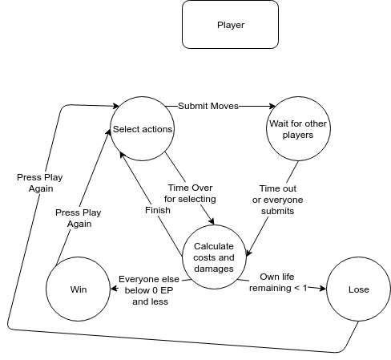

# Battle of the Four Gods - Game Design Document

## Table of Contents
1. Overview
2. Concept
3. Game Diagrams
4. Abbreviated Rules

## 1 Overview

### 1.1 Author
Ryan Taus

### 1.2 Title
Battle of The Four Gods

### 1.3 Elevator Pitch
Four players assume the roles of gods and their struggles against each other. Each round, players expend energy points to either attack or defend against each of the other players. Upon reaching 0 energy points (EP) a player loses. The last player standing wins.

### 1.4 Target Audience
The game is designed for family and friends who want to play a competitive board game. This game utilizes deceit and teaming up, so it is recommended for players who want a challenge, but do not take in-game actions personally. Additionally, it is recommended for online gamers who like games in which they must outwit their opponents.

### 1.5 Target Platform
Battle of the Four Gods is an networked game played through the web. Any PC is suitable for playing.

## 2 Concept

### 2.1 Story
The story is minimal. The four players act as gods that are in a constant battle against each other to become the main god of the universe. The battle is nearing the end when the players assume control. They then duke it out to see who will reign the universe as the sole God.

However, since the gods are so powerful, every action they perform costs some of their remaining life force. This means they must be careful about who they target and when.

### 2.2 Requirements to Play
Internet connection and a pointing device (mouse, tablet, etc.) for your computer.

## 3 Game Diagrams

### 3.1 Game Space

#### Notes:
The game space is seen on each of the four players computers. Each player has a unique color. The arrows and rectangles represent attacking and defending the other players. Once selected (via clicking), the aforementioned markers provide feedback to the player so that they know which actions they are to perform.

### 3.2 Game State

### 3.3 Game Flow

* Setup (Green): Players choose their colors and set up their respective blind spots.
* Main Gameplay Loop (Orange): Players have 40 seconds to select their actions and communicate between players. Then, once the select actions part of the round is done the result of the round is calculated. All the players EP are changed and they are alerted of which actions everyone performed. The next round immediately starts.
* Elimination (Purple): If a player reaches 0 EP they are eliminated. If a player is eliminated they cannot make actions and the other players cannot target them for attacks. If Three players are eliminated the last player remaining wins. If all remaining players are eliminated at the same time then the player with the EP closest to zero wins.

## 4 Rules, Abbreviated
Full rules available in the rulebook section.

The game is played in a sequence of rounds. A round consists of two parts, selection and scoring. During the selection part, each player concurrently chooses up to three actions. An action is attacking or defending another player. After everyone selects their action or a certain amount of time has passed the moves are submitted. Once all moves are submitted, scores are tallied up as detailed in the rule book.

If no scores change for five turns in a row, then every player loses 1 EP at the end of each round.

If 2 players are eliminated at the same time, the player who has a higher EP wins.

#### Starting Conditions
Each Player starts with 60 Energy Points (EP).
