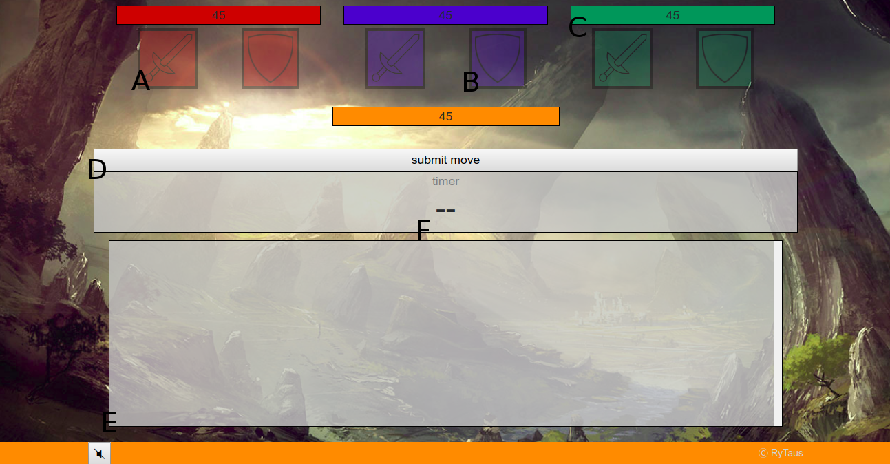

# Rule Book

## Contents
1. Summary
2. Components
3. Setup
4. Gameplay
5. Winning the Game
6. Annotated Gameboard
7. Summary of Terms

## 1 Summary
Battle of the Four Gods is played in a series of rounds where four players expend ENERGY POINTS in order to either ATTACK or DEFEND against other players. When a player reaches 0 ENERGY POINTS they are eliminated. The last player standing wins.

## 2 Components
To play Battle of the Four Gods you will need:
* A computer with internet connection

## 3 Game Setup
1. Each player logs onto the game website and joins a lobby. Upon joining the lobby each player is assigned a color: RED, BLUE, GREEN, or ORANGE.
2. Once four players have joined the same game, the game will start automatically, so be ready!

## 4 The Game

### The Round

A ROUND consists of 2 distinct phases.
* The Planning Phase: The TIMER starts. Each player concurrently selects up to 3 ACTIONS to take for this round.
* The Results Phase: Each player reduces their ENERGY POINTS as according to the ACTIONS section.

After the results phase, the game proceeds to the next round and starts with a new planning phase.

During all points of the game, except while results are being calculated, table talk is encouraged. Table talk refers not only to public speech, but also private messages to any of the players.

#### Sending Messages

To send a message type into the box indicated as E in section 6. By default, a message is sent to every player. However, you may start a message with a - followed by certain flags denoting which players to send it to. These flags are
* r: RED player
* b: BLUE player
* g: GREEN player
* o: ORANGE player

Also note that nothing is banned from the messaging system, so feel free to team up or lie about your intentions to the other players. May the most cunning god win.

#### Planning Phase
Each player selects anywhere from 0 to 3 ACTIONS to perform. Each action costs 1 ENERGY POINT. To select an action merely click on the icon indicating which one you wish to do. The icon will change indicating you have selected it. If you change your mind simply click it again and it will be removed from your list of selected actions. Then you may optionally press the submit button. If all players have submitted their moves or the TIMER has expired then play proceeds to the Results Phase.

Notes:
* A player cannot choose more actions than they have remaining ENERGY POINTS. If a player has 2 ENERGY POINTS then they can only select 2 actions.

#### Results Phase
The results phase processes the results of all the players selected actions. This is handled by the computer so the players do not need to keep track of their own ENERGY POINTS.

The results of actions are as follows.

1. Each player decreases their current ENERGY POINTS by 2 for every ATTACK, and 1 for every defense action.
2. For every ATTACK, if the targeted player did not DEFEND from the attacking player they lose 5 ENERGY POINTS, otherwise if the targeted player did DEFEND the ATTACK they are refunded 1 ENERGY POINT
3. Then the players are assessed based off of their current ENERGY POINT TOTAL. If a player's ENERGY POINTS total is 0 or below they are ELIMINATED. An eliminated player cannot select any actions and cannot be the target of a players actions. When either one or no players are not ELIMINATED the game ends.
4. Players are alerted the results of the RESULTS phase and are told which actions every player selected. The game then proceeds into the next ROUND.

## 5 Winning the Game
A player wins the game if at the end of a round every other player is eliminated.

In the case that at the end of a round every player has been eliminated, then the winner is the player with the largest amount of ENERGY POINTS that was eliminated during that round. If multiple players eliminated that round have the same amount of ENERGY POINTS then the game is a tie between those players.

## 6 Annotated Gameboard

- **A**: ATTACK action icon (RED)
- **B**: DEFEND action icon (BLUE)
- **C**: Indicates a players current health (GREEN)
- **D**: Submit move button. Press to submit your selected moves.
- **E**: Chatbox. Use to chat with other players as well as to get updated by the game as to who chose which actions.
- **F**: The timer. Indicates how much time remains in the round.

## 7 Terms

#### ACTION
Each player has access to 6 actions.
  * 3 **ATTACK** actions (1 for each opponent color) (Indicates the target)
  * 3 **DEFENSE** actions (1 for each opponent color) (Indicates the opponent defending from, or target)

The result of attacking a non-defending player is the targeted player losing 5 ENERGY POINTS

The result of attacking a defending player is the targeted player gaining 1 ENERGY POINTS.

The result of defending against nothing is nothing.

Each action has a uniform cost of 2 ENERGY POINT.

#### ELIMINATED
An eliminated player has dropped below 1 ENERGY POINT. They cannot take actions and they cannot be targeted for them.

#### ENERGY POINTS
Each player begins the game with 60 ENERGY POINTS. These serve as your life force during the game. Performing actions and receiving undefended ATTACKS drain your ENERGY POINTS. When a player reaches 0 ENERGY POINTS they are eliminated.

#### ROUND
A round consists of a planning phase and a results phase. The game is played via a sequence of rounds until the game reaches an ending state.

#### TIMER
The timer counts down the planning phase of the round. It lasts for 40 seconds.
