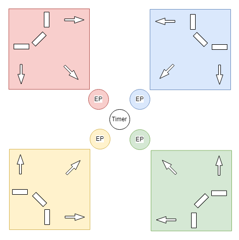
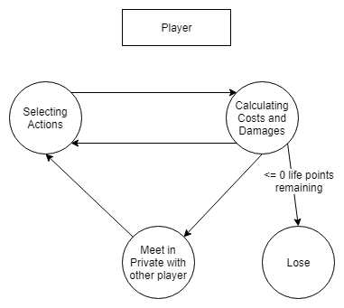
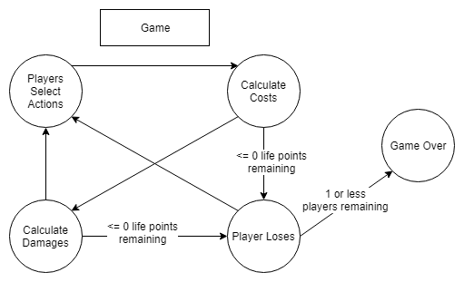

# Battle of the Four Gods - Game Design Document

## Table of Contents
1. Overview
2. Concept
3. Rules
4. Assets

## 1 Overview

### 1.1 Author
Ryan Taus

### 1.2 Title
Battle of The Four Gods

### 1.3 Elevator Pitch
4 players assume the roles of gods and their struggles against each other. Each round players expend energy points to either attack or defend against each of the other players. Upon reaching 0 energy points a player loses. Last player standing wins.

## 2 Concept

### 2.1 Story
The story is minimal. The four players act as gods that are in a constant battle against each other to become the main god of the universe. Only one can assume the role of the sole God.

### 2.2 Game Space

#### Notes:
The colored boxes around each player represents a zone where only they can see their actions. The arrows are where a player would place their attack piece if they decided to attack said player, and the parallel lines are where players place their defense.

### 2.3 Game State

### 2.3 Game Flow

* Setup (Green): Players choose their colors and set up their respective blind spots.
* Main Gameplay Loop (Orange): Players have 30 seconds to select their actions. They place their actions behind their screens and when time is up reveal their actions. Then they decrease their total LP for each action they select. Then, Players reduce their LP for each time they are hit with an attack they did not defend. Table Talk is encouraged.
* Strategy Time (Yellow): The player with he least amount of LP chooses a player to meet with (or to forego the meeting period). The pairs of people meet in private and can discuss strategy for 1 minute.
* Elimination (Purple): If a player reaches 0 LP they are eliminated. If 3 players are eliminated the last character remaining wins.

## 3 Rules

A game consists of multiple rounds. Each round consists of 2 phases. The move selection phase and the damage calculation phase. During the move selection phase each player in secret chooses anywhere from 0-3 actions. An action can be to attack or defend any of the other players. Next, the players all reveal their actions synchronously. Players deduct from their current LP 1 point for each action they selected. Next, for each time a player receives an attack without defending it they lose 3 LP. If a player is reduced to 0 LP they are eliminated. (A player cannot commit more actions than their remaining LP, however, they may reduce themselves to 0). (If a player is eliminated their attacks still got through for that round). If a player is eliminated the remaining players can no longer attack or defend from the eliminated player. After every 10 rounds the player with the least amount of LP can opt to select one player to meet with privately. If multiple players are tied the meeting period is delayed until one player has sole possession of last place. They may talk strategy in private, and so can the other pair. This continues until only one player remains.

If no scores change for 5 turns in a row then every player loses 1 LP at the end of each round.

If 2 players are eliminated at the same time the player who has a higher LP wins.

### Starting Conditions
Each Player Starts with 100 Life Points (LP).
